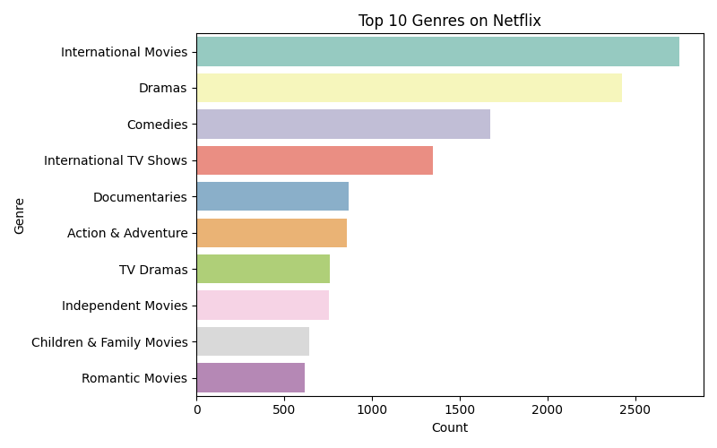
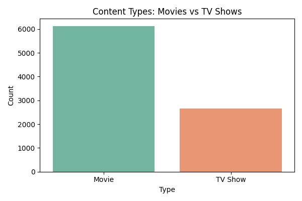
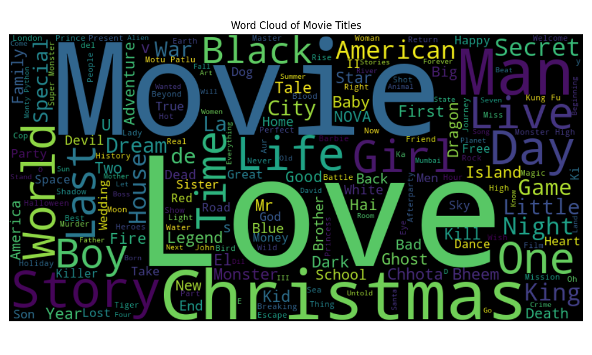

# 🎬 Netflix Data Analysis and Interactive Dashboard

This project is a complete data analysis and visualization pipeline for Netflix titles, involving **data cleaning**, **exploratory data analysis (EDA)**, and the development of an **interactive dashboard** using **Streamlit**.

---

## 📌 Project Overview

This project aims to explore and understand the content available on Netflix using a dataset obtained from Kaggle. It includes:

- 📥 Loading and cleaning the dataset using **Pandas**
- 📊 Performing EDA using **Matplotlib** and **Seaborn**
- ☁️ Creating a **word cloud** of movie titles
- 📈 Analyzing genre distributions, ratings, and release trends
- 🌐 Building an **interactive dashboard** using **Streamlit**

---

## 🧰 Technologies Used

- **Python 3**
- **Pandas**, **NumPy**
- **Matplotlib**, **Seaborn**
- **WordCloud**
- **Streamlit**

---

## 📂 Repository Structure

```
netflix-data-analysis/
├── app.py                    # Streamlit dashboard app
├── netflix_analysis.py       # Python script for data cleaning and EDA
├── netflix1.csv              # Netflix dataset
├── type_distribution.png     # EDA plot - Type distribution
├── top_genres.png            # EDA plot - Top genres
├── wordcloud.png             # EDA plot - Word cloud of movie titles
└── README.md                 # Project documentation
```

---

## 🧼 Data Cleaning

- Removed duplicates
- Dropped rows with missing values in critical columns (e.g., `director`, `cast`, `country`)
- Converted `date_added` to datetime
- Extracted `year_added` and `month_added` from the date
- Split `listed_in` into a list of genres

---

## 📊 Exploratory Data Analysis (EDA)

Visualizations created and saved:
- **Content Type Distribution**: Comparison of Movies vs. TV Shows
- **Top 10 Genres**: Most popular content genres
- **Word Cloud**: Highlighting frequent movie titles
- **Ratings Distribution**: Most frequent maturity ratings
- **Yearly Trend**: Content added to Netflix over the years

---

## 🧠 Streamlit Dashboard

### Features:
- Filter by **content type** (Movie / TV Show)
- Filter by **release year range**
- View:
  - Content distribution
  - Top 10 genres
  - Word cloud of movie titles
  - Content added over time
  - Ratings distribution

---

## 📊 Example Visuals

### 🎭 Top Genres
 


### 📺 Type Distribution


### ☁️ Word Cloud of Movie Titles


---

## 🧑‍💻 Author

**Kushi A.**  
3rd Year AI & DS Student  
Aspiring Data Analyst / Scientist  
Made using Python and Streamlit

---

